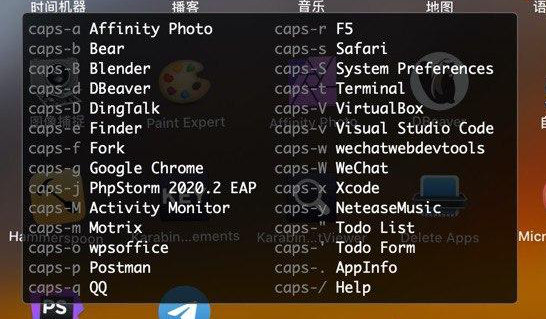

# Hammerspoon 为常用 App 绑定快捷键

## 预览



## 用法

1. `caps + 字符` 打开指定的 App
1. `caps + ?` 显示已绑定快捷键的 App

连按同一个快捷键可以在已打开的 App 的各窗口间循环切换

## 配置

编辑 hotkey.lua，在 `apps` 中修改 app 及其快捷键；

**注意 key 是区分大小写的**，当设置为大写时快捷按需要增加一个 shift，例：

```
'key' = 'A': capslock + shift + a
'key' = 'a': capslock + a
'key' = '@': capslock + shift + 2
'key' = '2': capslock + 2
'key' = '<': capslock + shift + ,
'key' = ',': capslock + ,
```

## 文件清单

以下功能需要在 init.lua 中启用：

1. `hotkey.lua` 常用 App 及其绑定的绑定快捷键
1. `ime.lua` 切换到中文输入法（废弃未使用）
1. `winSwitch.lua` 类似 cmd+tab 的窗口切换（废弃未使用）
1. `work.lua` 根据位置切换 wifi（废弃未使用）

## Karabiner-Elements 里设置 hyper 键的 json

* 按下 capslock + {其它键} 时相当于按下 command + option + control + {其它键}
* 当没有按下 {其它键} 时还是本身的 capslock 的功能

```jsonnet
// ~/.config/karabiner/assets/complex_modifications/capslock2hyper.json

{
  "title": "capslock2hyper",
  "rules": [
    {
      "description": "Hyper(⌃⌥⌘)",
      "manipulators": [
        {
          "from": {
            "key_code": "caps_lock",
            "modifiers": {
              "optional": ["any"]
            }
          },
          "to": [
            {
              "key_code": "right_control",
              "modifiers": ["right_command", "right_option"]
            }
          ],
          "to_if_alone": {
            "hold_down_milliseconds": 100,
            "key_code": "caps_lock"
          },
          "type": "basic"
        }
      ]
    }
  ]
}
```
